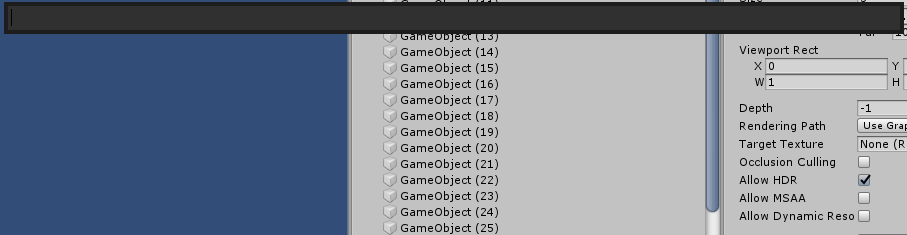
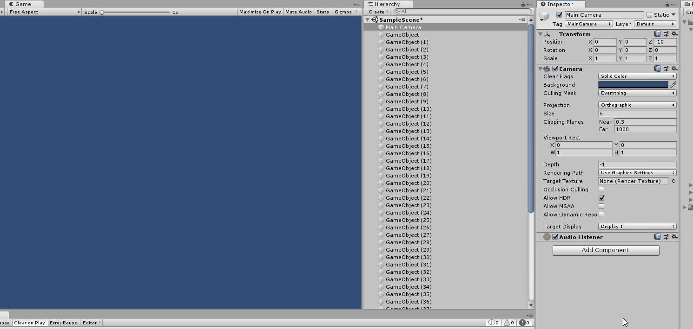

# Unity Commander
This is an implementation of a spotlight-like search for Unity 2018.3 using UI Elements. There are no plans to continue work on it now that Unity has their own quick search and there are still some problems and bugs, but maybe it is helpful for someone somewhere.
Note that UI Elements are still experimental in Unity 2018.3 and you have to put in some work to make it work in 2019.1+ that have changed the functionality of UI Elements in some places.
To use it, open the project in Unity and go to `Window/Asset Finder` etc. to open the tool and see the hotkeys. Alternatively, you can also use the `unitypackage` file in this repository to install the tool. 

It comes with three different tools:
 * The asset finder which finds asset files
   
 * The scene finder which finds objects in a scene
   
 * The commander which finds commands (menu items)
   

The architecture of the code is roughly as follows:
 * Each of the three tools is based on `FinderPrompt`, which handles showing the actual prompt. Internally, that one has a `Finder` that does most of the actual work.
 * Each tool provides an `ISearchResultDisplayer`, an `ISearchResultProcessor`, and an `ISearchLens`. Their responsibilities are as follows:
    * `ISearchResultDisplayer` is basically a factory that allows to create the visual items that make up the search result list and set the data of an item,
    * `ISearchResultProcessor` handles what happens when the user submits an item (i.e. presses enter),
    * and `ISearchLens` provides the search data.

It's probably a good idea to start with the `Commander` class if you want to see a simple example. The `AssetFinder` is noteworthy because it is actually distributing the search across multiple frames by keeping track of a time budget.